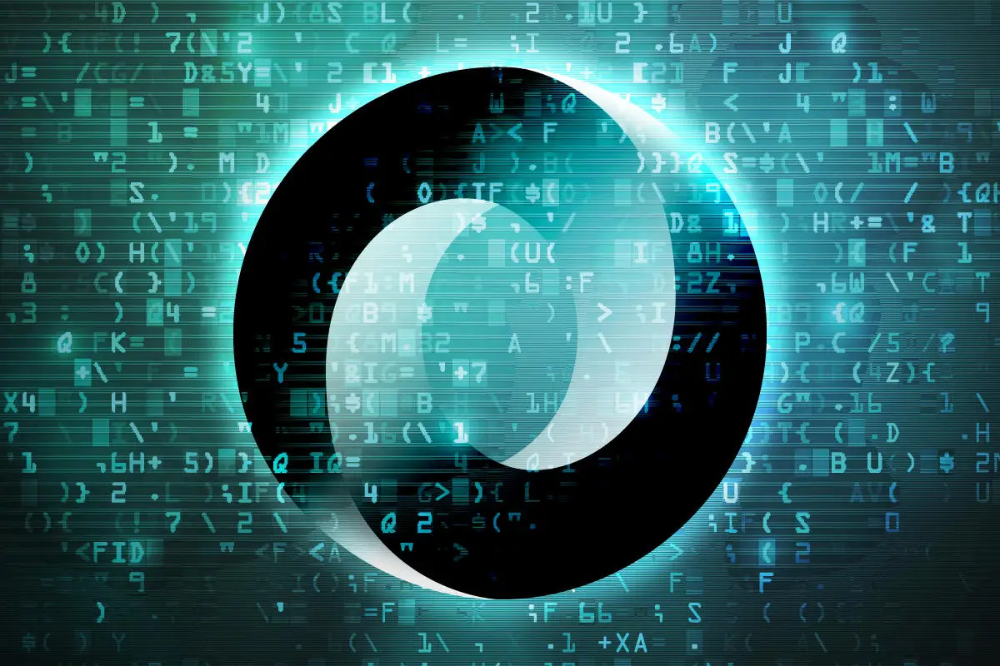

# **Working with JSON data in Python**

> 

# Introduction to JSON

- JSON(**J**ava**S**cript **O**bject **N**otation) is a lightweight data-interchange format.
- It is easy for humans to read and write.
- It is easy for machines to parse and generate.
- It is based on a subset of the JavaScript Programming Language Standard ECMA-262 3rd Edition - December 1999.
- JSON is a text format that is completely language independent but uses conventions that are familiar to programmers of the C-family of languages, including C, C++, C#, Java, JavaScript, Perl, Python, and many others.
- These properties make JSON an ideal data-interchange language.

# Data types in JSON

JSON consists of the following data types:

1. String: a sequence of zero or more Unicode characters, wrapped in ==double quotes==.
2. Number: an integer, or a floating-point.
3. Object
   - 👉 It's an unordered set of name-value pairs, wrapped in curly braces.
   - 👉 Begins with =={== ~left brace~ and ends with ==}== ~right brace~.
   - 👉 Each name is followed by a ~colon~ ==:==.
   - 👉 The name/value pairs are separated by ==,== ~comma~.
4. Array: an ordered list of zero or more values, wrapped in square brackets.
5. Boolean: represents a logical entity and can have two values: true or false.
6. Null: represents a null value.
